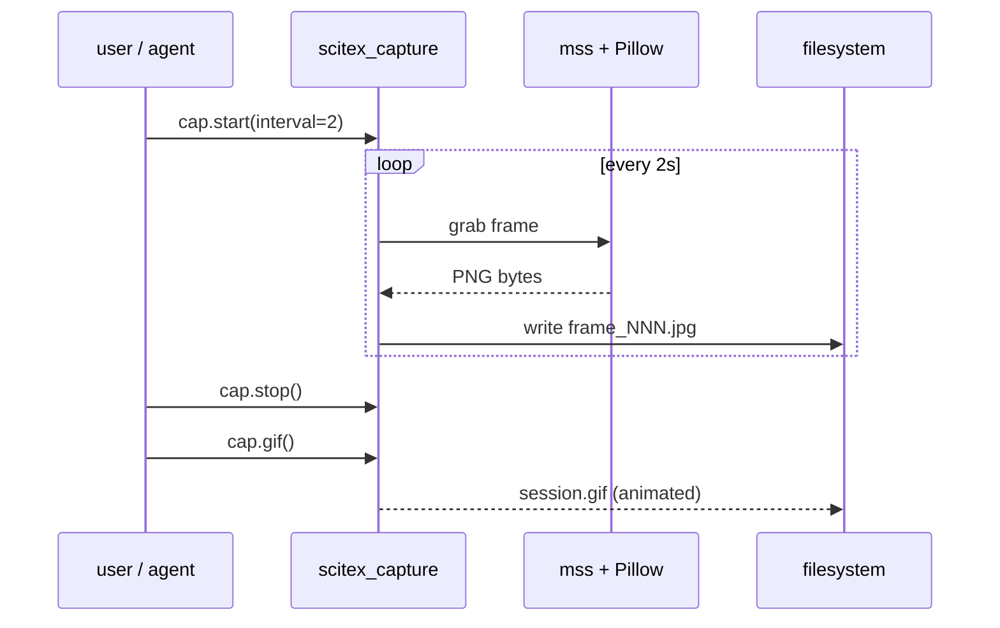

# scitex-capture

<p align="center">
  <a href="https://scitex.ai">
    
  </a>
</p>

<p align="center"><b>Session-based screen capture — single screenshots, multi-frame sessions → animated GIFs, grid overlays, monitor + cursor info. Optimised for WSL→Windows host and for AI agents that need a "what does my screen look like right now" tool.</b></p>

<p align="center">
  <a href="https://scitex-capture.readthedocs.io/">Full Documentation</a> · <code>uv pip install scitex-capture[all]</code>
</p>

<!-- scitex-badges:start -->
<p align="center">
  <a href="https://pypi.org/project/scitex-capture/"></a>
  <a href="https://pypi.org/project/scitex-capture/"></a>
  <a href="https://github.com/ywatanabe1989/scitex-capture/actions/workflows/test.yml"></a>
  <a href="https://codecov.io/gh/ywatanabe1989/scitex-capture"></a>
  <a href="https://scitex-capture.readthedocs.io/en/latest/"></a>
  <a href="https://www.gnu.org/licenses/agpl-3.0"></a>
</p>
<!-- scitex-badges:end -->

---

## Architecture

```
scitex-capture/
├── src/scitex_capture/
│   ├── __init__.py              # snap, start, stop, gif, get_info
│   ├── capture.py               # ScreenshotWorker, CaptureManager
│   ├── cli.py                   # scitex-capture CLI (Click)
│   ├── gif.py                   # GIF creation (GifCreator)
│   ├── grid.py                  # Grid overlay utilities
│   ├── session.py               # Session context manager
│   ├── utils.py                 # capture(), start_monitor(), stop_monitor()
│   ├── _paths.py                # Canonical filesystem layout
│   ├── _mcp/                    # MCP handlers & tool schemas
│   ├── mcp_server.py            # Standalone MCP server (deprecated)
│   └── powershell/              # Windows host capture scripts
├── docs/
│   ├── sphinx/                  # API docs (Read the Docs)
│   └── *.png                    # Logo assets
├── tests/                       # 252 tests pass (zero mocks)
└── examples/
    └── quickstart.py
```

## Installation

```bash
pip install scitex-capture
pip install "scitex-capture[mcp]"          # + MCP server
pip install "scitex-capture[playwright]"   # + browser capture
pip install "scitex-capture[all]"          # everything
```

## 2 Interfaces

<details open>
<summary><strong>Python API</strong></summary>

<br>

```python
import scitex_capture as cap

# One-shot screenshot
path = cap.snap("debug message")
path = cap.snap(capture_all=True)

# Inspect monitors / windows
info = cap.get_info()

# Continuous session capture
cap.start(interval=2)
# ... do work ...
cap.stop()

# GIF from latest session
gif_path = cap.gif()

# Or from a specific session directory
cap.create_gif_from_files(paths, "output.gif")
cap.create_gif_from_pattern("frames_*.jpg")
cap.create_gif_from_session("20250823_104523")
```

</details>

<details>
<summary><strong>CLI</strong></summary>

<br>

```bash
scitex-capture --help
scitex-capture "debug message"              # snap with a message
scitex-capture --all                         # all monitors
scitex-capture --app chrome                  # capture a specific app
scitex-capture show-info                     # monitors, windows, desktops
scitex-capture start-monitor --interval 2    # continuous capture loop
scitex-capture stop-monitor                  # stop the loop
scitex-capture make-gif                      # GIF from latest session
scitex-capture list-windows                  # visible OS windows
scitex-capture mcp start                     # MCP server (for AI agents)
```

</details>

## Demo



## Status

Standalone fork of `scitex.capture`. Core deps: Pillow + mss + click (with
playwright + mcp as opt-ins). The umbrella package's `scitex.capture`
import path is preserved via a `sys.modules`-alias bridge. All 252 tests pass
with zero mocks.

## Part of SciTeX

`scitex-capture` is part of [**SciTeX**](https://scitex.ai). Install via
the umbrella with `pip install scitex[capture]` to use as
`scitex.capture` (Python) or `scitex capture ...` (CLI).

>Four Freedoms for Research
>
>0. The freedom to **run** your research anywhere — your machine, your terms.
>1. The freedom to **study** how every step works — from raw data to final manuscript.
>2. The freedom to **redistribute** your workflows, not just your papers.
>3. The freedom to **modify** any module and share improvements with the community.
>
>AGPL-3.0 — because we believe research infrastructure deserves the same freedoms as the software it runs on.

## License

AGPL-3.0-only (see [LICENSE](./LICENSE)).

---

<p align="center">
  <a href="https://scitex.ai" target="_blank"></a>
</p>
